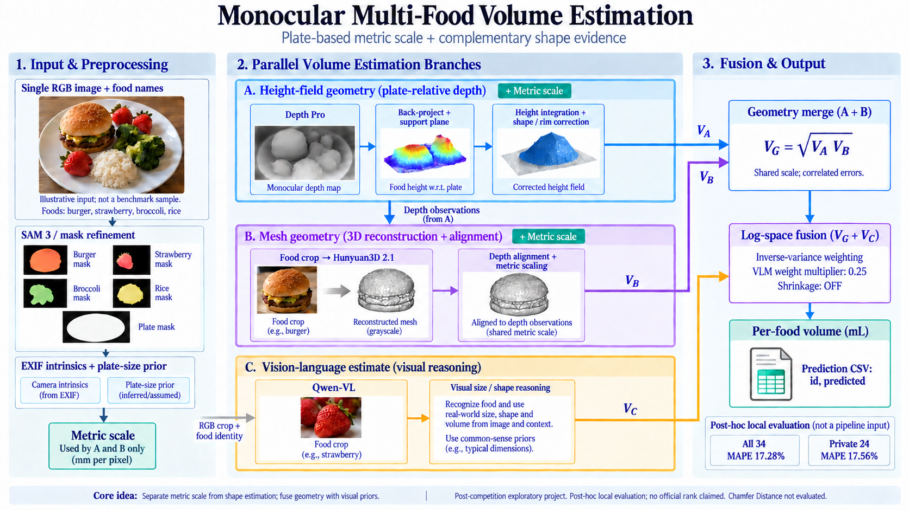

# Monocular Multi-Food Volume Estimation

Post-competition exploration of the CVPR 2025 MetaFood Challenge-1 dataset.
Separate **metric scale** from **shape**, combine depth geometry, reconstructed
meshes, and vision-language estimates, and predict food volume in mL.



The diagram's food/depth/mesh inserts are AI-generated illustrations, not
experimental evidence. Container foods follow a separate override described below.

## Results

Saved prediction CSVs were locally re-scored on 2026-10-06. Lower MAPE is better.
These are not newly retrieved official Kaggle scores or leaderboard rankings.

| Configuration | All 34 | Public 10 | Private 24 |
| --- | ---: | ---: | ---: |
| Earlier fusion | 19.80% | 20.08% | 19.68% |
| Rim-measurement configuration | 17.42% | 16.65% | 17.74% |
| **Final saved prediction, seeded alignment** | **17.28%** | **16.60%** | **17.56%** |

The [benchmark paper, Table 2](https://arxiv.org/html/2602.13041v1#S4)
reports MDMS 21%, SGPS 31%, PSHS 46%, and GPT-5.2 34% on 24 objects.
The closest local comparison is our **private-24** result, not all 34 objects.
Our numerically lower error is **not an independent SOTA claim**:

- This project was developed after the competition, with public/private feedback
  available according to the archived notes.
- The access-blocking harness checks inference file access only; it is not a
  security sandbox or evidence of leakage-free model/configuration selection.
- No matching Chamfer Distance evaluation or competition rank is established.
- The dataset is small and there is no verified external generalization study.

See [results and provenance](docs/results.md) and the
[visual explanation](docs/index.html). The HTML opens locally without a server.
This repository is suitable for GitHub Pages via the `docs/` folder; Pages has
not been enabled automatically.

## Method

1. **Masks and scale.** SAM-based food/plate segmentation, refinement, EXIF
   intrinsics, and inferred/assumed plate-size priors establish scene scale.
2. **Height-field path A.** Depth Pro, back-projection, support-plane fitting,
   height integration, and shape/rim correction estimate volume.
3. **Mesh path B.** Hunyuan3D 2.1 generates food meshes; depth alignment and metric
   scaling produce a second geometric volume estimate.
4. **Visual path C.** Qwen-VL estimates volume and supplies visual shape/size priors.
5. **Fusion.** A and B are combined geometrically before inverse-variance
   weighting in log space with C. The VLM weight multiplier is **0.25**, not a
   fixed 25% contribution. MAPE shrinkage is **off**.
6. **Container override.** When a valid container estimate is available,
   `make_grid.build()` uses that value directly, bypassing A/B/C fusion.

The source is an exploratory research implementation, including diagnostics and
alternative backends, not a newly validated production inference package.

## Code Map

| Area | Files |
| --- | --- |
| Paths, masks, camera, scale | `paths.py`, `segment*.py`, `intrinsics.py`, `scale_plate.py` |
| Depth and geometry | `backends/depth.py`, `geometry.py`, `apply_shape.py`, `shape_prior.py` |
| Mesh generation/alignment | `gen3d.py`, `align_mesh.py`, `pose_project.py` |
| Visual priors | `qwen_qc.py`, `qwen_shape.py` |
| Fusion | `fuse.py`, `make_grid.py`, `scripts/build_final.py` |
| Evaluation | `scripts/summarize_scores.py`, `scripts/run_blind.py` |

## Running

Dependency-free evaluation tests:

```bash
python3 -m unittest discover -s tests -v
```

For the numeric fusion/shape tests, install the core dependencies in a local
environment (GPU inference requires additional, separate setup):

```bash
uv venv --python 3.10 .venv
uv pip install --python .venv/bin/python -r requirements-core.txt
.venv/bin/python -m unittest discover -s tests -v
```

See [reproduction instructions](docs/reproduction.md) for dataset preparation,
model environments, and the historical final settings. A fresh end-to-end GPU
rerun is **not** claimed for this clean export.
Final fusion from the retained intermediate tables was rerun and matched the
saved final prediction CSV byte for byte; those tables are not redistributed.

With your own authorized GT CSV and saved predictions:

```bash
python3 scripts/summarize_scores.py --gt /path/to/gt_volumes.csv /path/to/predictions.csv
```

The scorer validates all 34 IDs, positive GT, and finite nonnegative predictions.
It emits full/public/private MAPE and content hashes without exporting GT values.

## Data and Third Parties

Download the [competition data](https://www.kaggle.com/competitions/3d-reconstruction-from-monocular-multi-food-images/data)
under its terms. Raw photos, derived dataset visualizations, GT volumes, model
weights, caches, and nested third-party repositories are **not included**.
Credentials must stay outside this repository.

See [third-party requirements](docs/third_party.md). No blanket software license
is assigned in this export; source ownership and third-party terms must be
reviewed before assigning one. The architecture illustration is not a grant of
rights to any competition dataset or model.
